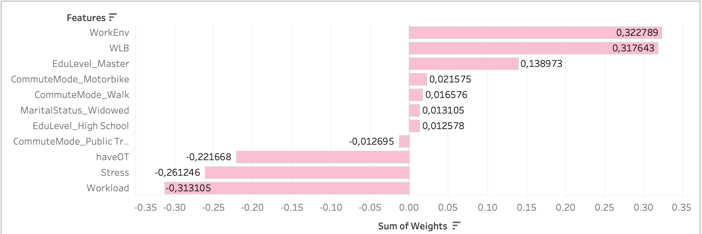

# Work-Satisfaction-Analysis

## 📊 Analysis Summary
This project analyzes employee job satisfaction using survey data from Kaggle.com. The aim was to identify key predictors and assess their impact
on job satisfaction, providing actionable insights for organizations to improve employee satisfaction.

 **Key Findings:**
- The regression model explained 23% of  the variance in work satisfaction. 
  
- The model achieved an **R² score of 0.23**, indicating weak predictive capability.
  
- Variables included in the final model:
   - Work-Life Balance (WLB): Positive correlation with job satisfaction.
   - Work Environment (WorkEnv): Positive correlation with job satisfaction.
   - Workload: Negative correlation with job satisfaction.
   - Stress: Negative correlation with job satisfaction.
     ](https://github.com/MbaliMabaso/Work-Satisfaction-Analysis/blob/d59f779eb3e72896ff7f7744503fbfe631f2653c/EmployeeSurveyRegressionWeights.png)
     
     
     
- Significant prediction errors indicate the dataset lacks key predictors, suggesting the need for a better survey design.

  ](https://github.com/MbaliMabaso/Work-Satisfaction-Analysis/blob/bebd191717f3d5e4acc66891bf900b82d436b3bd/EmployeeSurveyResiduals.png)
  
For a detailed analysis, check the **notebook** in 'EmployeeSurveyAnalysis`.

