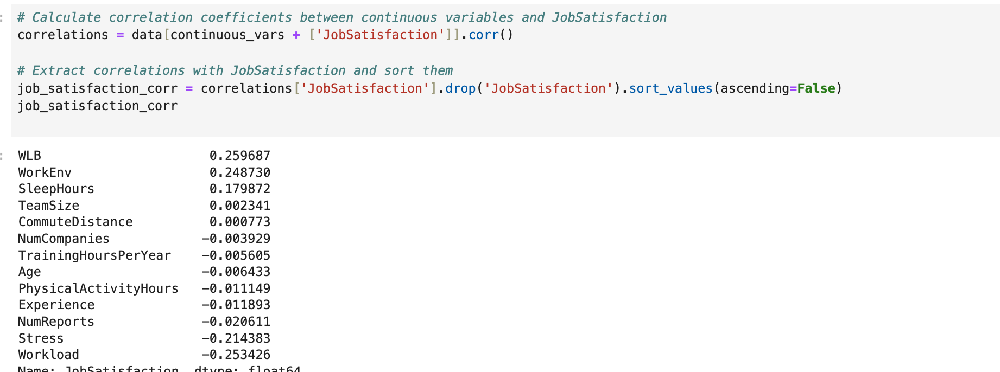
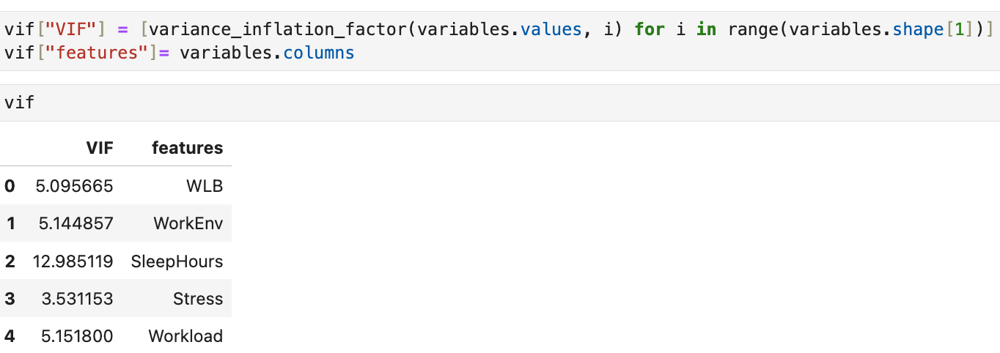

📊 Report

1️⃣ Introduction
Employee satisfaction is a critical factor influencing productivity, retention, and overall organizational success. This project investigates key predictors of work satisfaction, leveraging survey data and statistical modeling.

2️⃣ Research Question
What are the most significant factors influencing employee job satisfaction, and how well can we predict satisfaction using these variables?

3️⃣ Data Overview
Dataset: Employee survey responses from kaggle.com.
Sample Size: 3,025 employees.
Key Variables:
Independent Variables: Gender,Age, Marital Status, Job Level, Experience, Department, Employment type, Work life balance, Work environment, physical activity hours, Workload,
Stress, Sleep hours, Commute mode, Commute distance, Number of companies worked for, Team size, Number of reports, Educational level, Have over-time, Training hours per year.
Dependent Variable: Job Satisfaction. 

4️⃣ Exploratory Data Analysis (EDA)
- Missing Data: No significant missing values detected.
- Correlation Analysis: Work life balance, Work environment and sleep hours had positive correlations with job satisfaction. Stress and work load had negative correlations with
  job satisfaction. The correlations were small, ranging from .18 to .260.
  
  

- Multicollinearity: Sleep hours had a VIF > 10, therefore, it was removed from the model.
  
  
5️⃣ Regression Model & Performance
Model Used: Multiple Linear Regression
Formula:
Job Satisfaction = β0 + β1(WLB) + β2(WorkEnv) + β3(Workload) + β4(Stress) + ϵ
Performance Metrics:
R² Score: 0.23 (23% of variance explained)
Significant Predictors (p < 0.05): WLB, WorkEnv, Workload, Stress.

6️⃣ Key Insights & Interpretation

WorkEnv (work environment) has a positive relationship with job satisfaction (β = 0.322, p < 0.001). 
WLB (Work life balance) has a positive relationship with job satisfaction (β = 0.317, p < 0.001). 
Workload has a negative relationship with job satisfaction (β = -0.313, p < 0.001).
Stress has a negative relationship with job satisfaction (β = -0.261, p < 0.001).
These four variables explain 23 % of the variance in job satisfaction, making the predictive power of this model.

7️⃣ Challenges and limitations

Weak predictors: variables in this dataset had low correlations with job satisfaction, with correlations ranging from -0.253 and 0.260.
The fact that the model only explained 23% of the variance in Job satisfaction and the high residuals indicates that we are missing key contributors
to Job satisfaction.
The dataset lacked survey validation, raising concerns about construct validity and reliability.

8️⃣ Conclusion & Recommendations

This project illustrates real-world data analysis challenges and emphasizes the importance of rigorous survey design. 
My recommendation is to conduct a literature review to find a theoretical framework that captures job satisfaction and its correlates.
Moreover, create a new survey and test its reliability and construct validity by doing a confirmatory factor analysis, or use a validated measure of job satisfaction. For an example of an analysis that uses a theoretical framework that captures work satisfaction and its correlates, and uses confirmatory factor analysis for survey validation, please refer to the repository Basic_Pychological_Need_Satisfaction_And_Work_Satisfaction.

📂 Project Files:
Notebook: notebooks/employee_satisfaction.ipynb
Dataset: data/employee_satisfaction.csv

✉ Contact: For questions or collaboration, reach out via GitHub or email.
